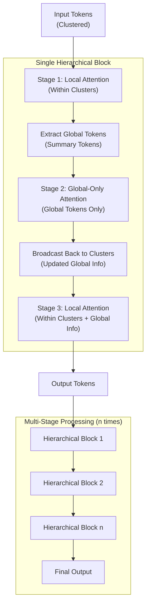

## Hierarchical Global–Local Processing for Nomeformer

This project implements a hierarchical attention workflow where tokens first interact locally within clusters, then only global (summary) tokens interact with each other, and finally tokens return to their clusters to interact again. This 3-stage pattern can be repeated for multiple stages to deepen cross-cluster communication.

### What’s included
- New attention blocks:
  - `GlobalOnlyMultiHeadAttention`
  - `GlobalOnlyTransformerBlock`
  - `HierarchicalTransformerBlock` (Local → Global-only → Local)
  - `MultiStageHierarchicalTransformerBlock` (repeats the pattern n times)
- Updated models:
  - `nomeformer(use_hierarchical, num_hierarchical_stages)`
  - `NomeformerPredictor(use_hierarchical, num_hierarchical_stages)`

### FlashAttention
All attention modules now use PyTorch's Scaled Dot-Product Attention with the FlashAttention kernel where available. The number of attention heads is configurable via the `num_heads` parameter (default: 4). FlashAttention can be disabled by setting `enable_flash=False` in the model constructor. Q/K/V are reshaped to `[B*N, H, L, head_dim]` and masks are boolean with `True` indicating masked/ignored positions as required by SDPA. A math-kernel fallback is enabled automatically for non-CUDA environments.

### Architecture (Visualization)


### Usage

#### nomeformer
```python
from model_G_2 import nomeformer

feature_dim = 128
embedding_dim = 256
num_heads = 8
num_blocks = 2

# Original behavior (Global-Local blocks)
model_gl = nomeformer(feature_dim, embedding_dim, num_heads, num_blocks)

# With FlashAttention disabled
model_no_flash = nomeformer(feature_dim, embedding_dim, num_heads, num_blocks, enable_flash=False)

# Single-stage hierarchical (Local → Global-only → Local)
model_h1 = nomeformer(
    feature_dim, embedding_dim, num_heads, num_blocks,
    use_hierarchical=True, num_hierarchical_stages=1
)

# Multi-stage hierarchical (repeat pattern n times)
model_hn = nomeformer(
    feature_dim, embedding_dim, num_heads, num_blocks,
    use_hierarchical=True, num_hierarchical_stages=3
)
```

Input/output shapes for `nomeformer`:
- Input `input_tensor`: `[batch, num_clusters, tokens_per_cluster, feature_dim]`
- Mask `masks_x`: `[batch, num_clusters, tokens_per_cluster]` (boolean)
- Output: `[batch, num_clusters, tokens_per_cluster, embedding_dim]`

#### NomeformerPredictor
```python
from model_G_2 import NomeformerPredictor

predictor = NomeformerPredictor(
    feature_dim=128,
    embed_dim=256,
    num_heads=8,
    num_attention_blocks=1,
    use_hierarchical=True,
    num_hierarchical_stages=3,
)
```

Predictor I/O (high-level):
- `batch`: raw input, typically `[B, N, T, feature_dim]`
- `x`: encoder context tokens, typically `[B*N, T, embed_dim]`
- `masks_x`: list with a context mask `[B, N, T]` (boolean)
- `masks`: target mask for replacement, shaped to align with predictor logic
- Returns predictions projected back to `embed_dim` with same token layout as input `x` after assembly

### Key design notes
- Global-only attention updates per-cluster summary tokens via interaction across clusters and redistributes the resulting global signal back to local tokens.
- Residual connections are applied across stages to preserve gradient flow and stability.
- Backward-compatible: set `use_hierarchical=False` to retain original behavior.

### Changed files
- `model_G_2.py`:
  - Added: `GlobalOnlyMultiHeadAttention`, `GlobalOnlyTransformerBlock`, `HierarchicalTransformerBlock`, `MultiStageHierarchicalTransformerBlock`
  - Updated: `nomeformer`, `NomeformerPredictor` with hierarchical options

### Minimal smoke test
```python
import torch
from model_G_2 import nomeformer

B, N, T, F = 2, 4, 8, 128
x = torch.randn(B, N, T, F)
m = torch.ones(B, N, T, dtype=torch.bool)

model = nomeformer(
    feature_dim=F, embedding_dim=256, num_heads=8, num_attention_blocks=2,
    use_hierarchical=True, num_hierarchical_stages=3,
)
with torch.no_grad():
    y = model(x, m)
print(y.shape)  # [2, 4, 8, 256]
```

# Meja